# الفصل الرابع منسق معا المخططات

> ملاحظة مواءمة مهمة:
> هذه الوثيقة تمثل وصفًا تحليليًا/أكاديميًا أقدم من التنفيذ الحالي للمشروع.
> المرجع التنفيذي المعتمد حاليًا للباك إند هو:
> `src/docs/BACKEND_WAVE1_STATUS.md`
> مع ملحق المواءمة:
> `src/docs/LEGACY_DOC_ALIGNMENT.md`
> لذلك إذا ظهر تعارض بين هذه الوثيقة وبين الكود الحالي، فالكود ووثائق `src/docs` هما مصدر الحقيقة لمرحلة التنفيذ.

- **مقدمة**

يهدف هذا الفصل إلى تحويل المتطلبات الوظيفية وغير الوظيفية التي تم تحديدها في الفصل الثالث إلى تصميم تقني متكامل يوضح كيفية بناء **منصة إشراف التعليمية الذكية**. يعتمد الفصل على تحليل دقيق لمكونات النظام، وتحديد بنيته المعمارية، والعلاقات بين مكوناته، بالإضافة إلى تصميم قاعدة البيانات وتدفقات البيانات. كما يتناول أدوار المستخدمين، وتحليل حالات الاستخدام، وبنية تكامل الخدمات، مع مراعاة الاعتبارات الأمنية وقابلية التوسع. يمثل هذا الفصل الأساس التقني الذي سيتم الاعتماد عليه في مرحلة التنفيذ.

- **نظرة عامة على معمارية النظام**

تم تصميم منصة **إشراف** باستخدام **بنية الخدمات المصغرة (Microservices Architecture)**، حيث يتم تقسيم وظائف النظام إلى مجموعة من الخدمات المستقلة التي تتواصل فيما بينها عبر واجهات برمجية موحدة. توفر هذه المعمارية:

- **فصل المكونات**: كل خدمة مسؤولة عن وظيفة محددة، مما يسهل التطوير والصيانة.
- **قابلية التوسع**: يمكن توسيع نطاق الخدمات الأكثر تحميلاً بشكل مستقل.
- **عزل الأعطال**: لا يؤثر تعطل خدمة على بقية الخدمات.
- **مرونة التقنيات**: يمكن استخدام تقنيات مختلفة لكل خدمة حسب المتطلبات.
- **الطبقات المعمارية**

تتكون معمارية النظام من أربع طبقات رئيسية:

1. **طبقة العرض (Presentation Layer)**: تضم تطبيقات المستخدمين النهائيين (تطبيقات جوالة باستخدام Flutter، ولوحة تحكم ويب).
2. **طبقة بوابة الخدمات (API Gateway)**: نقطة الدخول الموحدة لجميع الطلبات، وتقوم بتوجيهها إلى الخدمات المختصة، بالإضافة إلى إدارة المصادقة والتحقق.
3. **طبقة الخدمات المصغرة (Microservices Layer)**: مجموعة من الخدمات المستقلة، كل منها مسؤولة عن جزء محدد من وظائف النظام.
4. **طبقة البيانات (Data Layer)**: قواعد البيانات الرئيسية (PostgreSQL) والتخزين السحابي (Firebase) المستخدمة لحفظ البيانات الثابتة واللحظية.
- **المخطط المعماري العام**

### 4.2.2 المخطط المعماري العام

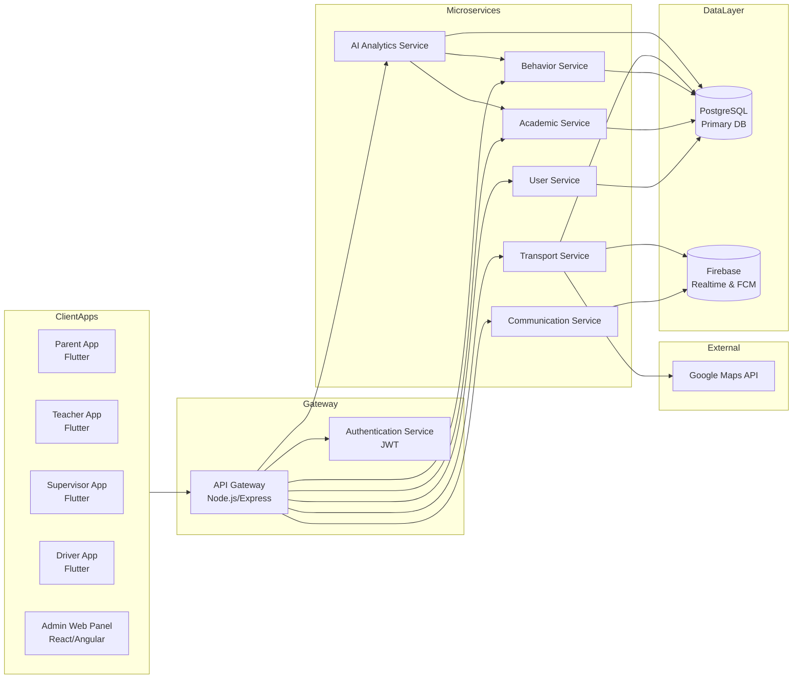

الشكل (4-1): المخطط المعماري لمنصة إشراف

يُظهر الشكل المكونات الرئيسية للنظام وكيفية تفاعلها. تقوم بوابة الخدمات باستقبال جميع الطلبات، وتوجيهها إلى الخدمات المختصة بعد التحقق من هوية المستخدم. تعتمد الخدمات على PostgreSQL للتخزين الدائم، بينما يُستخدم Firebase للإشعارات الفورية وتحديثات الموقع اللحظية. تتكامل خدمة النقل مع Google Maps API لتوفير إمكانية التتبع.

- **مخطط السياق للنظام**

يوضح مخطط السياق العلاقة بين النظام والجهات الخارجية التي تتفاعل معه، ويظهر حدود النظام والكيانات الخارجية المرتبطة به.

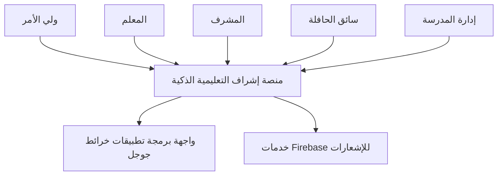

## 4.3 وصف مكونات النظام

### 4.3.1 تطبيقات المستخدمين (Flutter)

- **تطبيق ولي الأمر**: متابعة الأداء الأكاديمي والسلوكي للأبناء، تتبع الحافلات المدرسية، تلقي الإشعارات الفورية، التواصل مع المعلمين والإدارة.
- **تطبيق المعلم**: تسجيل الحضور والغياب، إدخال الدرجات، إنشاء الواجبات والاختبارات، تسجيل الملاحظات السلوكية، التواصل مع أولياء الأمور.
- **تطبيق المشرف**: متابعة السلوكيات اليومية، تسجيل الحضور والانصراف، الاطلاع على تقارير الصفوف.
- **تطبيق السائق**: عرض المسار اليومي، تحديث موقع الحافلة في الوقت الفعلي، تأكيد صعود ونزول الطلاب.
- **لوحة تحكم الإدارة**: إدارة المستخدمين، الصفوف، المواد، الحافلات، إصدار التقارير الشاملة، الإشراف على التحليلات الذكية.

### 4.3.2 بوابة الخدمات (API Gateway)

- نقطة دخول واحدة لجميع التطبيقات.
- إدارة المصادقة باستخدام JWT (JSON Web Tokens).
- توجيه الطلبات إلى الخدمات المناسبة.
- تطبيق سياسات الأمان والحد من معدل الطلبات (Rate Limiting).
- تسجيل جميع الطلبات لأغراض المراقبة والتدقيق.

### 4.3.3 الخدمات المصغرة

| الخدمة | المسؤوليات الرئيسية |
| --- | --- |
| **User Service** | إدارة حسابات المستخدمين (أولياء أمور، معلمين، مشرفين، سائقين، إدارة)، صلاحيات الأدوار، المصادقة، إعادة تعيين كلمة المرور. |
| **Academic Service** | إدارة البيانات الأكاديمية: الصفوف، المواد، الاختبارات، الدرجات، الواجبات، الحضور، الترقيات السنوية. |
| **Behavior Service** | تسجيل ومتابعة السلوكيات الطلابية، تحليل الأنماط السلوكية، إنشاء تقارير سلوكية. |
| **Transport Service** | إدارة الحافلات، المسارات، نقاط التوقف، تتبع الرحلات، التكامل مع Google Maps، حساب أوقات الوصول المتوقعة. |
| **Communication Service** | إدارة الرسائل الخاصة بين المستخدمين، الإعلانات العامة، والإشعارات الفورية عبر Firebase. |
| **AI Analytics Service** | تحليل البيانات الأكاديمية والسلوكية باستخدام خوارزميات تعلم الآلة (الانحدار اللوجستي، أشجار القرار، الغابة العشوائية، K-Means)، وإصدار التنبؤات والتوصيات. |

### 4.3.4 قواعد البيانات

- **PostgreSQL**: قاعدة البيانات الرئيسية لتخزين البيانات الهيكلية والمعاملات (المستخدمين، الدرجات، الحضور، السلوك، الحافلات، إلخ).
- **Firebase Realtime Database**: تخزين بيانات الموقع اللحظي للحافلات لتحديثات سريعة.
- **Firebase Cloud Messaging (FCM)**: إرسال الإشعارات الفورية إلى تطبيقات المستخدمين.

### 4.3.5 التكامل الخارجي

- **Google Maps API**: عرض الخرائط، حساب المسافات، تقدير وقت الوصول، وعرض مسارات الحافلات.

---

## 4.4 أدوار المستخدمين وتفاعلاتهم

تم تحديد خمسة أدوار رئيسية بصلاحيات محددة:

| الدور | الصلاحيات الرئيسية |
| --- | --- |
| **إدارة المدرسة** | إدارة كاملة للمستخدمين، الصفوف، المواد، الحافلات، الاطلاع على جميع التقارير، تحليلات الذكاء الاصطناعي، إعدادات النظام. |
| **المعلم** | إدارة الحضور، الدرجات، الواجبات، الاختبارات، تسجيل السلوكيات، التواصل مع أولياء الأمور، الاطلاع على تقارير صفوفه. |
| **المشرف** | متابعة السلوكيات اليومية، تسجيل الحضور والانصراف، الاطلاع على تقارير الصفوف التي يشرف عليها. |
| **ولي الأمر** | متابعة أداء الأبناء (درجات، حضور، سلوك)، تتبع الحافلات، التواصل مع المعلمين والإدارة، تلقي الإشعارات. |
| **سائق الحافلة** | عرض المسار، تحديث موقع الحافلة، تأكيد صعود ونزول الطلاب، التواصل مع الإدارة في الحالات الطارئة. |

## 4.5 تحليل حالات الاستخدام

تم تحديد 27 حالة استخدام رئيسية تغطي التفاعلات الأساسية مع النظام. يوضح الشكل (4-2) مخطط حالات الاستخدام العام.

```mermaid
flowchart LR
    Parent[ولي الأمر]
    Teacher[المعلم]
    Supervisor[المشرف]
    Driver[السائق]
    Admin[الإدارة]

    subgraph Platform[منصة إشراف]
        UC1((تسجيل الدخول))
        UC2((عرض بيانات الطالب))
        UC3((متابعة الحضور))
        UC4((متابعة الدرجات))
        UC5((متابعة السلوك))
        UC6((متابعة الواجبات))
        UC7((استقبال الإشعارات))
        UC8((إرسال واستقبال الرسائل))
        UC9((تتبع الحافلة))
        UC10((تسجيل الحضور))
        UC11((إنشاء الاختبارات))
        UC12((إدخال الدرجات))
        UC13((إضافة الواجبات))
        UC14((تسجيل حالة الواجب))
        UC15((تسجيل السلوك))
        UC16((إدارة المستخدمين))
        UC17((إدارة السنوات والفصول))
        UC18((إدارة المواد))
        UC19((إدارة الحافلات والمسارات))
        UC20((تعيين الطلاب للحافلات))
        UC21((تحديد فصول المشرف))
        UC22((نشر الإعلانات))
        UC23((إصدار التقارير))
        UC24((التحليل الذكي للأداء))
        UC25((بدء الرحلة))
        UC26((تحديث موقع الحافلة))
        UC27((إنهاء الرحلة))
    end

    Parent --> UC1 & UC2 & UC3 & UC4 & UC5 & UC6 & UC7 & UC8 & UC9
    Teacher --> UC1 & UC10 & UC11 & UC12 & UC13 & UC14 & UC15 & UC8
    Supervisor --> UC1 & UC5 & UC15 & UC23
    Driver --> UC1 & UC25 & UC26 & UC27
    Admin --> UC1 & UC16 & UC17 & UC18 & UC19 & UC20 & UC21 & UC22 & UC23 & UC24
```

## 4.8 تدفق عمل النظام (مخططات تدفق البيانات)

### 4.8.1 مخطط السياق (DFD Level 0)

يمثل هذا المخطط أعلى مستوى من التجريد، حيث يظهر النظام كعملية واحدة والكيانات الخارجية التي تتفاعل معه، دون أي تفاصيل داخلية.

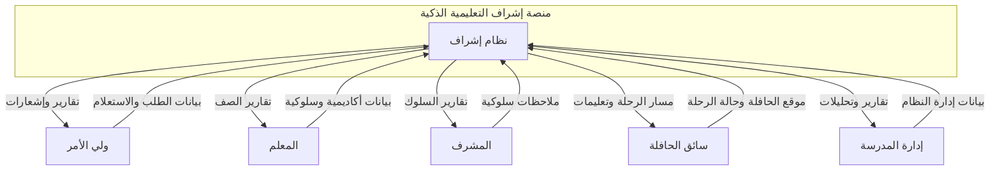

**الشكل (4-5): مخطط السياق (DFD Level 0) لمنصة إشراف**

### 4.8.2 مخطط تدفق البيانات - المستوى الأول (DFD Level 1)

يفصل هذا المخطط النظام إلى ثماني عمليات رئيسية، ويظهر مخازن البيانات الأساسية وتدفقات البيانات بين العمليات والكيانات الخارجية.

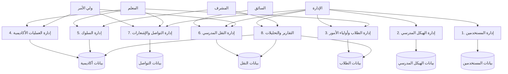

**الشكل (4-6): مخطط تدفق البيانات - المستوى الأول (DFD Level 1)**

### 4.8.3 مخطط تدفق البيانات - المستوى الثاني (DFD Level 2) - عملية إدارة العمليات الأكاديمية

يفصل هذا المخطط العملية الرئيسية **"إدارة العمليات الأكاديمية" (P4)** إلى خمس عمليات فرعية، مع إظهار مخازن البيانات الخاصة بها وتدفقات البيانات الداخلية.

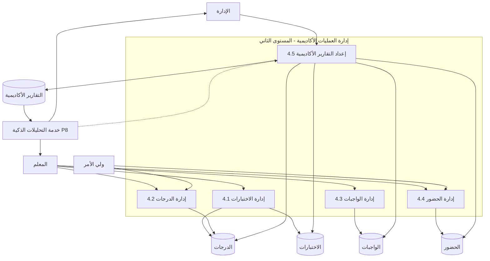

**الشكل (4-7): مخطط تدفق البيانات - المستوى الثاني (DFD Level 2) - إدارة العمليات الأكاديمية**

### 4.8.4 مخطط تدفق البيانات - المستوى الثاني (DFD Level 2) - عملية إدارة النقل المدرسي (اختياري)

يمكن تطبيق نفس المنهجية على عمليات رئيسية أخرى، مثل إدارة النقل المدرسي.

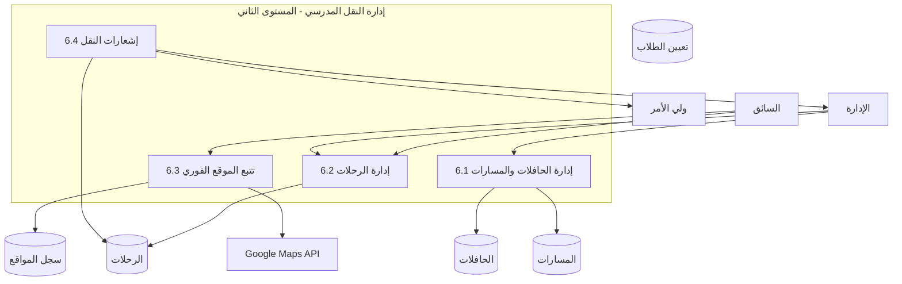

**الشكل (4-8): مخطط تدفق البيانات - المستوى الثاني (DFD Level 2) - إدارة النقل المدرسي**

### 4.7.4 مخططات التسلسل

### أ) تسجيل حضور الطلاب

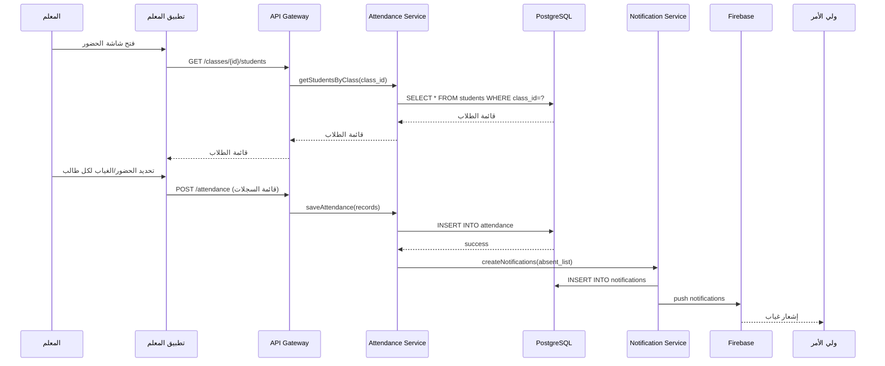

**الشكل (4-6): مخطط تسلسل تسجيل الحضور**

### ب) تتبع الحافلة المدرسية

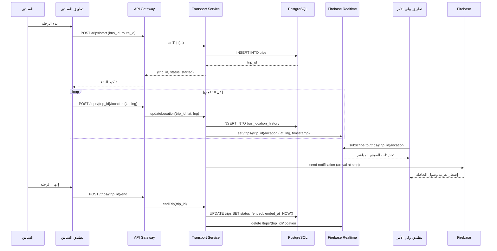

**الشكل (4-7): مخطط تسلسل تتبع الحافلة**

### ج) تسجيل سلوك طالب

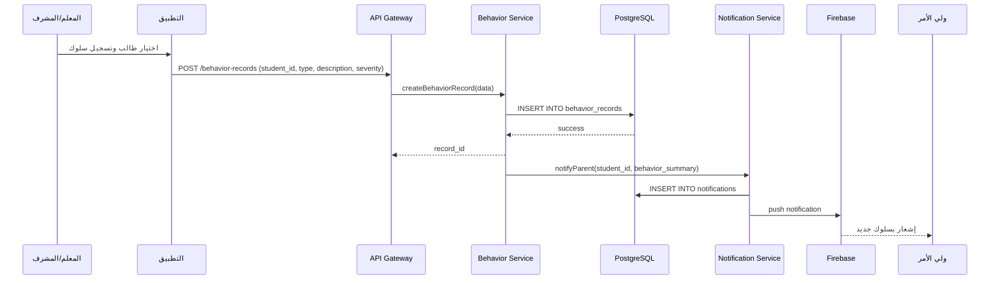

**الشكل (4-8): مخطط تسلسل تسجيل السلوك**

## 4.6 تصميم قاعدة البيانات

تم تصميم قاعدة البيانات باستخدام **PostgreSQL** نظراً لموثوقيتها ودعمها للعلاقات المعقدة والمعاملات (ACID). يوضح الشكل (4-3) مخطط الكيانات والعلاقات (ERD) الرئيسي.

```mermaid
erDiagram
    USERS {
        bigint id PK
        varchar full_name
        varchar email
        varchar phone
        varchar password_hash
        varchar role
        boolean is_active
        timestamp created_at
    }

    PARENTS {
        bigint id PK
        bigint user_id FK
        text address
        varchar relation_type
    }

    TEACHERS {
        bigint id PK
        bigint user_id FK
        varchar specialization
        varchar qualification
        date hire_date
    }

    SUPERVISORS {
        bigint id PK
        bigint user_id FK
        varchar department
    }

    DRIVERS {
        bigint id PK
        bigint user_id FK
        varchar license_number
        varchar driver_status
    }

    ACADEMIC_YEARS {
        bigint id PK
        varchar name
        boolean is_active
    }

    SEMESTERS {
        bigint id PK
        bigint academic_year_id FK
        varchar name
        date start_date
        date end_date
    }

    GRADE_LEVELS {
        bigint id PK
        varchar name
        int level_order
    }

    CLASSES {
        bigint id PK
        bigint grade_level_id FK
        bigint academic_year_id FK
        varchar class_name
        varchar section
    }

    STUDENTS {
        bigint id PK
        varchar academic_no
        varchar full_name
        date date_of_birth
        varchar gender
        bigint class_id FK
        varchar status
    }

    STUDENT_PARENTS {
        bigint id PK
        bigint student_id FK
        bigint parent_id FK
        varchar relation_type
        boolean is_primary
    }

    SUBJECTS {
        bigint id PK
        varchar name
        bigint grade_level_id FK
    }

    TEACHER_CLASSES {
        bigint id PK
        bigint teacher_id FK
        bigint class_id FK
        bigint subject_id FK
    }

    SUPERVISOR_CLASSES {
        bigint id PK
        bigint supervisor_id FK
        bigint class_id FK
    }

    ATTENDANCE {
        bigint id PK
        bigint student_id FK
        bigint teacher_id FK
        bigint class_id FK
        bigint semester_id FK
        date attendance_date
        varchar status
        text notes
    }

    HOMEWORK {
        bigint id PK
        bigint teacher_id FK
        bigint class_id FK
        bigint subject_id FK
        text title
        text description
        date due_date
    }

    HOMEWORK_STATUS {
        bigint id PK
        bigint homework_id FK
        bigint student_id FK
        varchar status
        timestamp submitted_at
    }

    EXAMS {
        bigint id PK
        bigint class_id FK
        bigint subject_id FK
        bigint teacher_id FK
        bigint semester_id FK
        varchar exam_type
        decimal max_score
        date exam_date
    }

    GRADES {
        bigint id PK
        bigint exam_id FK
        bigint student_id FK
        decimal score
        text remarks
    }

    BEHAVIOR_RECORDS {
        bigint id PK
        bigint student_id FK
        bigint teacher_id FK
        bigint supervisor_id FK
        varchar behavior_type
        text description
        int severity
        date behavior_date
    }

    BUSES {
        bigint id PK
        varchar plate_number
        bigint driver_id FK
        varchar status
    }

    ROUTES {
        bigint id PK
        varchar route_name
        text start_point
        text end_point
    }

    BUS_STOPS {
        bigint id PK
        bigint route_id FK
        varchar stop_name
        decimal latitude
        decimal longitude
        int stop_order
    }

    STUDENT_BUS_ASSIGNMENTS {
        bigint id PK
        bigint student_id FK
        bigint route_id FK
        bigint stop_id FK
        date start_date
        date end_date
        boolean is_active
    }

    TRIPS {
        bigint id PK
        bigint bus_id FK
        bigint route_id FK
        date trip_date
        varchar trip_type
        varchar trip_status
        timestamp started_at
        timestamp ended_at
    }

    BUS_LOCATION_HISTORY {
        bigint id PK
        bigint trip_id FK
        decimal latitude
        decimal longitude
        timestamp recorded_at
    }

    MESSAGES {
        bigint id PK
        bigint sender_user_id FK
        bigint receiver_user_id FK
        text message_body
        timestamp sent_at
    }

    ANNOUNCEMENTS {
        bigint id PK
        bigint created_by FK
        varchar title
        text content
        timestamp created_at
    }

    NOTIFICATIONS {
        bigint id PK
        bigint user_id FK
        varchar title
        text message
        varchar notification_type
        boolean is_read
        timestamp created_at
    }

    STUDENT_PROMOTIONS {
        bigint id PK
        bigint student_id FK
        bigint from_class_id FK
        bigint to_class_id FK
        bigint academic_year_id FK
        timestamp promoted_at
    }

    USERS ||--o| PARENTS : has
    USERS ||--o| TEACHERS : has
    USERS ||--o| SUPERVISORS : has
    USERS ||--o| DRIVERS : has

    ACADEMIC_YEARS ||--o{ SEMESTERS : contains
    GRADE_LEVELS ||--o{ CLASSES : includes
    ACADEMIC_YEARS ||--o{ CLASSES : organizes

    CLASSES ||--o{ STUDENTS : has
    STUDENTS ||--o{ STUDENT_PARENTS : linked_to
    PARENTS ||--o{ STUDENT_PARENTS : linked_to

    GRADE_LEVELS ||--o{ SUBJECTS : includes
    TEACHERS ||--o{ TEACHER_CLASSES : assigned_to
    CLASSES ||--o{ TEACHER_CLASSES : contains
    SUBJECTS ||--o{ TEACHER_CLASSES : teaches

    SUPERVISORS ||--o{ SUPERVISOR_CLASSES : assigned_to
    CLASSES ||--o{ SUPERVISOR_CLASSES : monitored_by

    STUDENTS ||--o{ ATTENDANCE : has
    TEACHERS ||--o{ ATTENDANCE : records
    CLASSES ||--o{ ATTENDANCE : for
    SEMESTERS ||--o{ ATTENDANCE : belongs_to

    TEACHERS ||--o{ HOMEWORK : creates
    CLASSES ||--o{ HOMEWORK : receives
    SUBJECTS ||--o{ HOMEWORK : belongs_to
    HOMEWORK ||--o{ HOMEWORK_STATUS : tracked_by
    STUDENTS ||--o{ HOMEWORK_STATUS : completes

    CLASSES ||--o{ EXAMS : has
    SUBJECTS ||--o{ EXAMS : belongs_to
    TEACHERS ||--o{ EXAMS : creates
    SEMESTERS ||--o{ EXAMS : scheduled_in
    EXAMS ||--o{ GRADES : contains
    STUDENTS ||--o{ GRADES : receives

    STUDENTS ||--o{ BEHAVIOR_RECORDS : has
    TEACHERS ||--o{ BEHAVIOR_RECORDS : records
    SUPERVISORS ||--o{ BEHAVIOR_RECORDS : records

    DRIVERS ||--o{ BUSES : drives
    ROUTES ||--o{ BUS_STOPS : contains
    STUDENTS ||--o{ STUDENT_BUS_ASSIGNMENTS : assigned_to
    ROUTES ||--o{ STUDENT_BUS_ASSIGNMENTS : includes
    BUS_STOPS ||--o{ STUDENT_BUS_ASSIGNMENTS : pickup_at
    BUSES ||--o{ TRIPS : executes
    ROUTES ||--o{ TRIPS : follows
    TRIPS ||--o{ BUS_LOCATION_HISTORY : records

    USERS ||--o{ MESSAGES : sends_or_receives
    USERS ||--o{ NOTIFICATIONS : receives
    USERS ||--o{ ANNOUNCEMENTS : creates

    STUDENTS ||--o{ STUDENT_PROMOTIONS : promoted
    CLASSES ||--o{ STUDENT_PROMOTIONS : from_or_to
    ACADEMIC_YEARS ||--o{ STUDENT_PROMOTIONS : within
```

**الشكل (4-3): مخطط الكيانات والعلاقات (ERD)**

### 4.6.1 قاموس البيانات (Data Dictionary)

يقدم هذا القسم وصفاً تفصيلياً لأهم الجداول في قاعدة البيانات، مع بيان الحقول الرئيسية وأنواعها ووصف مختصر. يمثل هذا القاموس مرجعاً متكاملاً لفريق التطوير.

### جدول USERS (المستخدمون)

| الحقل | النوع | الوصف |
| --- | --- | --- |
| id | BIGINT (PK) | المعرف الفريد للمستخدم |
| full_name | VARCHAR(150) | الاسم الكامل |
| email | VARCHAR(150) | البريد الإلكتروني (فريد) |
| phone | VARCHAR(20) | رقم الهاتف |
| password_hash | TEXT | كلمة المرور بعد التشفير (bcrypt) |
| role | VARCHAR(30) | الدور (admin, teacher, parent, supervisor, driver) |
| is_active | BOOLEAN | حالة الحساب (نشط/غير نشط) |
| created_at | TIMESTAMP | تاريخ إنشاء الحساب |

### جدول PARENTS (أولياء الأمور)

| الحقل | النوع | الوصف |
| --- | --- | --- |
| id | BIGINT (PK) | المعرف الفريد |
| user_id | BIGINT (FK) | مرجع إلى المستخدم ([USER.id](http://user.id/)) |
| address | TEXT | العنوان |
| relation_type | VARCHAR(50) | صلة القرابة (أب، أم، ولي أمر) |

### جدول TEACHERS (المعلمون)

| الحقل | النوع | الوصف |
| --- | --- | --- |
| id | BIGINT (PK) | المعرف الفريد |
| user_id | BIGINT (FK) | مرجع إلى المستخدم |
| specialization | VARCHAR(100) | التخصص |
| qualification | VARCHAR(100) | المؤهل العلمي |
| hire_date | DATE | تاريخ التوظيف |

### جدول SUPERVISORS (المشرفون)

| الحقل | النوع | الوصف |
| --- | --- | --- |
| id | BIGINT (PK) | المعرف الفريد |
| user_id | BIGINT (FK) | مرجع إلى المستخدم |
| department | VARCHAR(100) | القسم المشرف عليه |

### جدول DRIVERS (السائقون)

| الحقل | النوع | الوصف |
| --- | --- | --- |
| id | BIGINT (PK) | المعرف الفريد |
| user_id | BIGINT (FK) | مرجع إلى المستخدم |
| license_number | VARCHAR(50) | رقم رخصة القيادة |
| driver_status | VARCHAR(30) | الحالة (متفرغ، متعاقد) |

### جدول ACADEMIC_YEARS (السنوات الدراسية)

| الحقل | النوع | الوصف |
| --- | --- | --- |
| id | BIGINT (PK) | المعرف الفريد |
| name | VARCHAR(50) | اسم السنة (مثال: 2024-2025) |
| is_active | BOOLEAN | هل السنة الحالية نشطة؟ |

### جدول SEMESTERS (الفصول الدراسية)

| الحقل | النوع | الوصف |
| --- | --- | --- |
| id | BIGINT (PK) | المعرف الفريد |
| academic_year_id | BIGINT (FK) | مرجع إلى السنة الدراسية |
| name | VARCHAR(50) | اسم الفصل (الأول، الثاني) |
| start_date | DATE | تاريخ البداية |
| end_date | DATE | تاريخ النهاية |

### جدول GRADE_LEVELS (المستويات الدراسية)

| الحقل | النوع | الوصف |
| --- | --- | --- |
| id | BIGINT (PK) | المعرف الفريد |
| name | VARCHAR(50) | اسم المستوى (الصف الأول، الثاني...) |
| level_order | INT | الترتيب (1،2،3...) |

### جدول CLASSES (الفصول)

| الحقل | النوع | الوصف |
| --- | --- | --- |
| id | BIGINT (PK) | المعرف الفريد |
| grade_level_id | BIGINT (FK) | مرجع إلى المستوى الدراسي |
| academic_year_id | BIGINT (FK) | مرجع إلى السنة الدراسية |
| class_name | VARCHAR(100) | اسم الفصل (مثال: 1-أ) |
| section | VARCHAR(20) | الشعبة (أ، ب، ج) |

### جدول STUDENTS (الطلاب)

| الحقل | النوع | الوصف |
| --- | --- | --- |
| id | BIGINT (PK) | المعرف الفريد |
| academic_no | VARCHAR(50) | الرقم الأكاديمي (فريد) |
| full_name | VARCHAR(150) | اسم الطالب |
| date_of_birth | DATE | تاريخ الميلاد |
| gender | VARCHAR(10) | الجنس (ذكر/أنثى) |
| class_id | BIGINT (FK) | مرجع إلى الفصل الحالي |
| status | VARCHAR(30) | الحالة (منتظم، منقول، منقطع) |

### جدول STUDENT_PARENTS (الربط بين الطلاب وأولياء الأمور)

| الحقل | النوع | الوصف |
| --- | --- | --- |
| id | BIGINT (PK) | المعرف الفريد |
| student_id | BIGINT (FK) | مرجع إلى الطالب |
| parent_id | BIGINT (FK) | مرجع إلى ولي الأمر |
| relation_type | VARCHAR(50) | صلة القرابة |
| is_primary | BOOLEAN | هل هو ولي الأمر الأساسي؟ |

### جدول SUBJECTS (المواد)

| الحقل | النوع | الوصف |
| --- | --- | --- |
| id | BIGINT (PK) | المعرف الفريد |
| name | VARCHAR(100) | اسم المادة |
| grade_level_id | BIGINT (FK) | المستوى الدراسي المرتبط |

### جدول TEACHER_CLASSES (توزيع المعلمين)

| الحقل | النوع | الوصف |
| --- | --- | --- |
| id | BIGINT (PK) | المعرف الفريد |
| teacher_id | BIGINT (FK) | مرجع إلى المعلم |
| class_id | BIGINT (FK) | مرجع إلى الفصل |
| subject_id | BIGINT (FK) | مرجع إلى المادة |

### جدول SUPERVISOR_CLASSES (توزيع المشرفين)

| الحقل | النوع | الوصف |
| --- | --- | --- |
| id | BIGINT (PK) | المعرف الفريد |
| supervisor_id | BIGINT (FK) | مرجع إلى المشرف |
| class_id | BIGINT (FK) | مرجع إلى الفصل |

### جدول ATTENDANCE (الحضور)

| الحقل | النوع | الوصف |
| --- | --- | --- |
| id | BIGINT (PK) | المعرف الفريد |
| student_id | BIGINT (FK) | مرجع إلى الطالب |
| teacher_id | BIGINT (FK) | مرجع إلى المعلم المسجل |
| class_id | BIGINT (FK) | مرجع إلى الفصل |
| semester_id | BIGINT (FK) | مرجع إلى الفصل الدراسي |
| attendance_date | DATE | تاريخ الحضور |
| status | VARCHAR(20) | الحالة (حاضر، غائب، متأخر، بعذر) |
| notes | TEXT | ملاحظات |

### جدول HOMEWORK (الواجبات)

| الحقل | النوع | الوصف |
| --- | --- | --- |
| id | BIGINT (PK) | المعرف الفريد |
| teacher_id | BIGINT (FK) | مرجع إلى المعلم المنشئ |
| class_id | BIGINT (FK) | مرجع إلى الفصل المستهدف |
| subject_id | BIGINT (FK) | مرجع إلى المادة |
| title | TEXT | عنوان الواجب |
| description | TEXT | وصف الواجب |
| due_date | DATE | تاريخ التسليم |

### جدول HOMEWORK_STATUS (حالة الواجب)

| الحقل | النوع | الوصف |
| --- | --- | --- |
| id | BIGINT (PK) | المعرف الفريد |
| homework_id | BIGINT (FK) | مرجع إلى الواجب |
| student_id | BIGINT (FK) | مرجع إلى الطالب |
| status | VARCHAR(30) | الحالة (مسلم، لم يسلم، متأخر) |
| submitted_at | TIMESTAMP | وقت التسليم |

### جدول EXAMS (الاختبارات)

| الحقل | النوع | الوصف |
| --- | --- | --- |
| id | BIGINT (PK) | المعرف الفريد |
| class_id | BIGINT (FK) | مرجع إلى الفصل |
| subject_id | BIGINT (FK) | مرجع إلى المادة |
| teacher_id | BIGINT (FK) | مرجع إلى المعلم |
| semester_id | BIGINT (FK) | مرجع إلى الفصل الدراسي |
| exam_type | VARCHAR(50) | نوع الاختبار (شهري، نهائي) |
| max_score | DECIMAL(5,2) | الدرجة العظمى |
| exam_date | DATE | تاريخ الاختبار |

### جدول GRADES (الدرجات)

| الحقل | النوع | الوصف |
| --- | --- | --- |
| id | BIGINT (PK) | المعرف الفريد |
| exam_id | BIGINT (FK) | مرجع إلى الاختبار |
| student_id | BIGINT (FK) | مرجع إلى الطالب |
| score | DECIMAL(5,2) | الدرجة المحققة |
| remarks | TEXT | ملاحظات |

### جدول BEHAVIOR_RECORDS (سجلات السلوك)

| الحقل | النوع | الوصف |
| --- | --- | --- |
| id | BIGINT (PK) | المعرف الفريد |
| student_id | BIGINT (FK) | مرجع إلى الطالب |
| teacher_id | BIGINT (FK) | مرجع إلى المعلم (اختياري) |
| supervisor_id | BIGINT (FK) | مرجع إلى المشرف (اختياري) |
| behavior_type | VARCHAR(30) | النوع (إيجابي، سلبي) |
| description | TEXT | وصف السلوك |
| severity | INT | درجة الخطورة (1-5) |
| behavior_date | DATE | تاريخ التسجيل |

### جدول BUSES (الحافلات)

| الحقل | النوع | الوصف |
| --- | --- | --- |
| id | BIGINT (PK) | المعرف الفريد |
| plate_number | VARCHAR(30) | رقم اللوحة |
| driver_id | BIGINT (FK) | مرجع إلى السائق |
| status | VARCHAR(30) | الحالة (عاملة، متعطلة) |

### جدول ROUTES (المسارات)

| الحقل | النوع | الوصف |
| --- | --- | --- |
| id | BIGINT (PK) | المعرف الفريد |
| route_name | VARCHAR(100) | اسم المسار |
| start_point | TEXT | نقطة البداية |
| end_point | TEXT | نقطة النهاية |

### جدول BUS_STOPS (نقاط التوقف)

| الحقل | النوع | الوصف |
| --- | --- | --- |
| id | BIGINT (PK) | المعرف الفريد |
| route_id | BIGINT (FK) | مرجع إلى المسار |
| stop_name | VARCHAR(100) | اسم النقطة |
| latitude | DECIMAL(10,7) | خط العرض |
| longitude | DECIMAL(10,7) | خط الطول |
| stop_order | INT | الترتيب على المسار |

### جدول STUDENT_BUS_ASSIGNMENTS (تعيين الطلاب للحافلات)

| الحقل | النوع | الوصف |
| --- | --- | --- |
| id | BIGINT (PK) | المعرف الفريد |
| student_id | BIGINT (FK) | مرجع إلى الطالب |
| route_id | BIGINT (FK) | مرجع إلى المسار |
| stop_id | BIGINT (FK) | مرجع إلى نقطة التوقف |
| start_date | DATE | تاريخ بدء التعيين |
| end_date | DATE | تاريخ انتهاء التعيين |
| is_active | BOOLEAN | هل التعيين نشط حالياً؟ |

### جدول TRIPS (الرحلات)

| الحقل | النوع | الوصف |
| --- | --- | --- |
| id | BIGINT (PK) | المعرف الفريد |
| bus_id | BIGINT (FK) | مرجع إلى الحافلة |
| route_id | BIGINT (FK) | مرجع إلى المسار |
| trip_date | DATE | تاريخ الرحلة |
| trip_type | VARCHAR(20) | النوع (ذهاب، عودة) |
| trip_status | VARCHAR(30) | الحالة (مجدولة، بدأت، انتهت) |
| started_at | TIMESTAMP | وقت البدء الفعلي |
| ended_at | TIMESTAMP | وقت الانتهاء الفعلي |

### جدول BUS_LOCATION_HISTORY (سجل مواقع الحافلات)

| الحقل | النوع | الوصف |
| --- | --- | --- |
| id | BIGINT (PK) | المعرف الفريد |
| trip_id | BIGINT (FK) | مرجع إلى الرحلة |
| latitude | DECIMAL(10,7) | خط العرض |
| longitude | DECIMAL(10,7) | خط الطول |
| recorded_at | TIMESTAMP | وقت التسجيل |

### جدول MESSAGES (الرسائل)

| الحقل | النوع | الوصف |
| --- | --- | --- |
| id | BIGINT (PK) | المعرف الفريد |
| sender_user_id | BIGINT (FK) | مرجع إلى المرسل |
| receiver_user_id | BIGINT (FK) | مرجع إلى المستقبل |
| message_body | TEXT | نص الرسالة |
| sent_at | TIMESTAMP | وقت الإرسال |

### جدول ANNOUNCEMENTS (الإعلانات)

| الحقل | النوع | الوصف |
| --- | --- | --- |
| id | BIGINT (PK) | المعرف الفريد |
| created_by | BIGINT (FK) | مرجع إلى منشئ الإعلان |
| title | VARCHAR(150) | عنوان الإعلان |
| content | TEXT | محتوى الإعلان |
| created_at | TIMESTAMP | تاريخ الإنشاء |

### جدول NOTIFICATIONS (الإشعارات)

| الحقل | النوع | الوصف |
| --- | --- | --- |
| id | BIGINT (PK) | المعرف الفريد |
| user_id | BIGINT (FK) | مرجع إلى المستلم |
| title | VARCHAR(150) | عنوان الإشعار |
| message | TEXT | نص الإشعار |
| notification_type | VARCHAR(50) | نوع الإشعار (حضور، درجة، سلوك، حافلة) |
| is_read | BOOLEAN | حالة القراءة |
| created_at | TIMESTAMP | وقت الإنشاء |

### جدول STUDENT_PROMOTIONS (ترقيات الطلاب)

| الحقل | النوع | الوصف |
| --- | --- | --- |
| id | BIGINT (PK) | المعرف الفريد |
| student_id | BIGINT (FK) | مرجع إلى الطالب |
| from_class_id | BIGINT (FK) | الفصل السابق |
| to_class_id | BIGINT (FK) | الفصل الجديد |
| academic_year_id | BIGINT (FK) | السنة الدراسية للترقية |
| promoted_at | TIMESTAMP | وقت الترقية |

---
